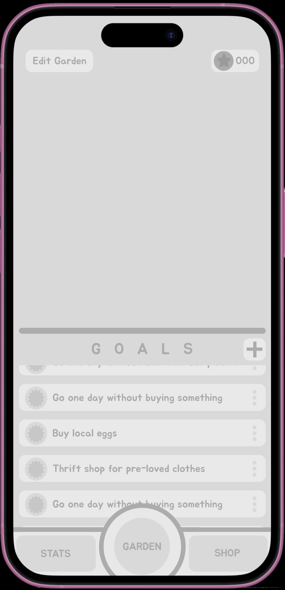
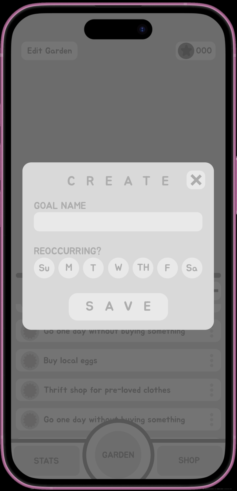
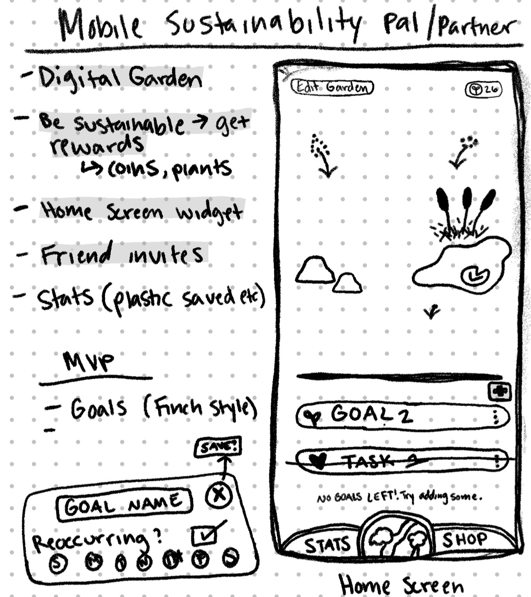
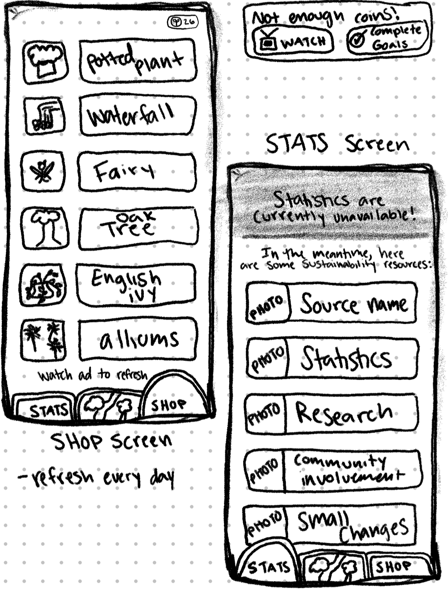

# Sustainability Pal 🌱 💫 (work in progress)

Hackathon Spring 2025! – University of New Orleans' ACM-W **x** Tulane University's Girls Who Code; <b>Theme</b>: Social Innovation or Sustainability

<b>Technologies</b>: Figma

---

<i>Medium-fidelity prototype</i>

<b>→ Interact with my prototype on [Figma's website](https://www.figma.com/proto/xAaKCIL9uoIsoZeUa4ncLa/Mobile-Sustainability-Partner?node-id=0-1&t=wi1yTVq21Kvc3Y3D-1)!</b>

---

<i>Low-fidelity prototype</i>

---

<a href="#readme-top"><i>(back to top)</i></a>

<i>Last update: March 29, 2025</i></a>
